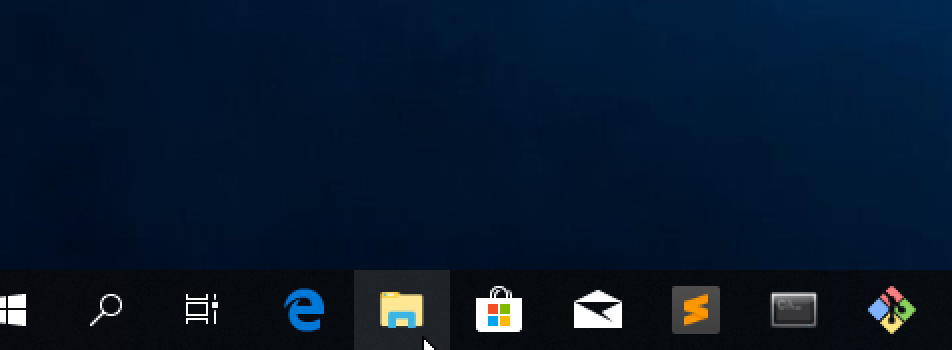
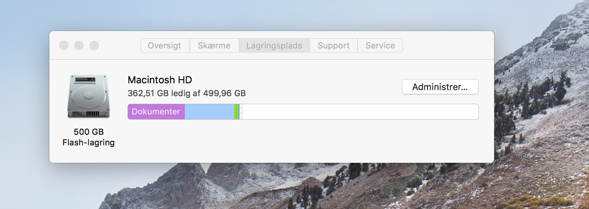

# A guide to checking whether you have enough free space on Windows and MacOS

## Windows

- First, click on the folder icon in the bottom of the screen as in the picture below.

- Second, click on “This PC” or “Denne PC”.


- Then see how much space there are left on your local disc C, just as shown in the picture below.


-----------------

## Mac

- First, click on the apple icon in the upper left corner and then on “About this Mac” or “Om denne Mac”.

- Second, click on “lagringsplads” or “Discspace”.

