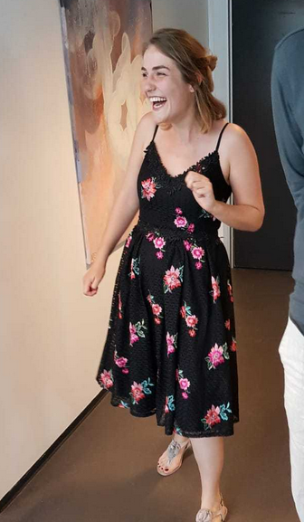
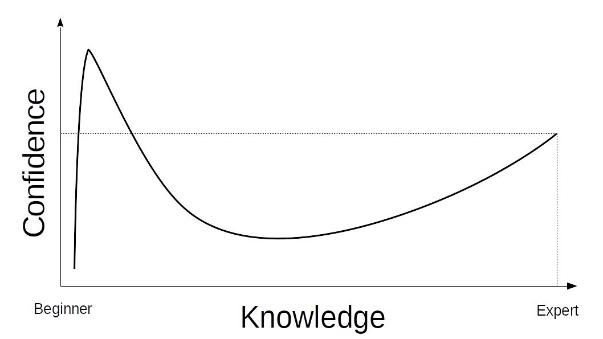
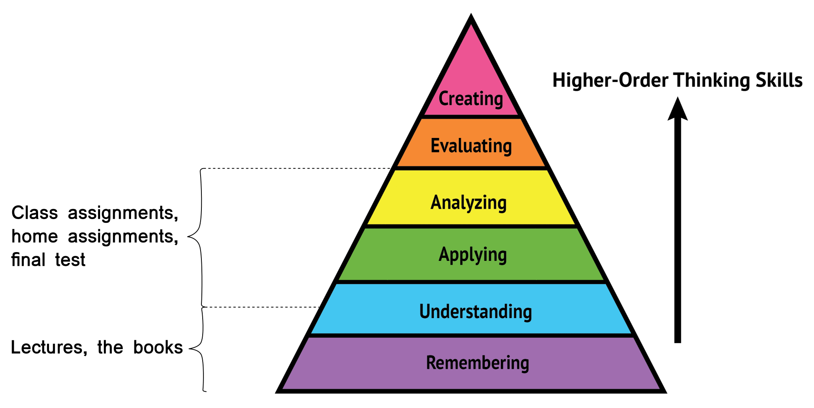

<!--
---
jupyter:
  jupytext:
    text_representation:
      extension: .md
      format_name: markdown
      format_version: '1.1'
      jupytext_version: 1.1.7
  kernelspec:
    display_name: Python 3
    language: python
    name: python3
---
-->

<!-- #region {"slideshow": {"slide_type": "slide"}} -->
# Learning to learn

### ... And why you should care

1. Introducing us
2. Dunning-Kruger effect
3. Meta learning
4. Metacognition
5. Summary
<!-- #endregion -->

<!-- #region {"slideshow": {"slide_type": "slide"}} -->
# But first; about us
<!-- #endregion -->

<!-- #region {"slideshow": {"slide_type": "subslide"}} -->
# Helge

  * Dipl-Inf. in Software Engineering from Friedrich-Schiller Universität Jena
  * TA and research assistant at Friedrich-Schiller Universität Jena
<!-- #endregion -->

<!-- #region {"slideshow": {"slide_type": "subslide"}} -->
# Helge

  * PhD in Software Engineering from ITU
  * Software engineer at DMI
  * Lecturer at Cphbusiness
  * Since January back to ITU as adjunkt in the Center for Public IT
<!-- #endregion -->

<!-- #region {"slideshow": {"slide_type": "subslide"}} -->
# Jens

* BSc. political science
* BSc. software development (ITU)
* MSc. IT & Cognition
<!-- #endregion -->

<!-- #region {"slideshow": {"slide_type": "subslide"}} -->
# Jens

* TA and research assistant at ITU
* Software engineer at CERN
* Lecturer at Cphbusiness
* Researching spiking neural networks
<!-- #endregion -->

<!-- #region {"slideshow": {"slide_type": "subslide"}} -->
# The TAs
<!-- #endregion -->

<!-- #region {"slideshow": {"slide_type": "subslide"}} -->
# Anna

* Designer-turned-Data-Science-student at ITU
* Crazy plant lady with a blue belt in taekwondo
* reis@itu.dk
<!-- #endregion -->

<!-- #region {"slideshow": {"slide_type": "subslide"}} -->
# Jana

<ul>
<li>Bachelor in International Management (Finance & Strategy)</li>
<li>Got excited about the possibilities of coding at first job in Berlin: An NGO providing web tools for online donations.</li>
<li>Moved to Denmark and started Master in Software Development in 2017, with specialization in Algorithms.</li>
<li>Got her degree last week Monday. YAY!</li>
<li>Super excited to be here. YAY YAY!</li>
</ul>

<!-- #endregion -->

<!-- #region {"slideshow": {"slide_type": "subslide"}} -->
# Morten

* Biochemist degree from Aarhus University
* Data Science student at ITU
* ITU tip: Kitchens w/ microwave ovens on 2nd, 3rd, 4th, and 5th floor
* morg@itu.dk
<!-- #endregion -->

<!-- #region {"slideshow": {"slide_type": "subslide"}} -->
# Viktor

* Data Science
* Culinary school dropout
* Food, climbing and Downton Abbey
<!-- #endregion -->

<!-- #region {"slideshow": {"slide_type": "slide"}} -->
# Being human

* Contrary to computers, humans are genius guessing machines
<!-- #endregion -->

<!-- #region {"slideshow": {"slide_type": "fragment"}} -->
* ... Except when it comes to our own abilities
<!-- #endregion -->

<!-- #region {"slideshow": {"slide_type": "fragment"}} -->

<!-- #endregion -->

<!-- #region {"slideshow": {"slide_type": "subslide"}} -->
## Dunning-Kruger effect

* Unskilled and unaware of it: why people fail to recognise their incompetence

<!-- #endregion -->

<!-- #region {"slideshow": {"slide_type": "fragment"}} -->
* This course is technical, and it's ok
  * The best strategy is to acknowledge that you have something to learn
<!-- #endregion -->

<!-- #region {"slideshow": {"slide_type": "fragment"}} -->
* If you are not failing, you are doing it wrong!
  * "A person who never made a mistake never tried anything new."
<!-- #endregion -->

<!-- #region {"slideshow": {"slide_type": "slide"}} -->
# Meta learning

* Learning how to learn
  * "Being aware of and taking control of one’s own learning" - John Biggs
<!-- #endregion -->

<!-- #region {"slideshow": {"slide_type": "fragment"}} -->
1. Planning
  * Selection of strategies
2. Monitoring
  * Awareness of comprehension and task performance
3. Evaluating
  * Appraising and correct strategies
<!-- #endregion -->

<!-- #region {"slideshow": {"slide_type": "subslide"}} -->
You may have seen Bloom's taxonomy before.
The important point is that lower levels are prerequisite for higher levels but higher levels powerfully reinforce lower levels.

<!-- #endregion -->

<!-- #region {"slideshow": {"slide_type": "fragment"}} -->
* Most importantly: learning is **not** free
<!-- #endregion -->

<!-- #region {"slideshow": {"slide_type": "subslide"}} -->
## Meta learning example 1: Handwritten notes

* Your conceptual understanding increases when you take notes by hand
  * A study [on students and their note taking habits](https://www.scientificamerican.com/article/a-learning-secret-don-t-take-notes-with-a-laptop/)
* Cognitive processing improves when you interact physically
<!-- #endregion -->

<!-- #region {"slideshow": {"slide_type": "subslide"}} -->
## Meta learning example 2: Avoid multitasking

* Brains are notoriously bad at multitasking
* Apparently **40%** of your time in class is spent on unrelated activities
  * Study on [affects of multitasking with laptops](https://eric.ed.gov/?id=EJ893903)
<!-- #endregion -->

<!-- #region {"slideshow": {"slide_type": "fragment"}} -->
* Take-away
  1. Exploit your tactile senses to take physical notes
  2. Have the self-discipline to shut down your laptop when we speak
<!-- #endregion -->

<!-- #region {"slideshow": {"slide_type": "slide"}} -->
# Metacognition

A [study on metacognition](https://phys.org/news/2017-10-metacognition-boosts-gen-chem-exam.html) shows that teaching students about metacognition gives better grades:

  > "The students who are successful will ask themselves—what is this question asking me to do? How does that relate
  > to what we're doing in class? Why are they giving me this question? If there's an equation, why does this equation
  > work? That's the metacognitive part.
  > If they will kick that in, they will see their grades go straight through the roof."
  >
  > Charles Atwood
<!-- #endregion -->

<!-- #region {"slideshow": {"slide_type": "subslide"}} -->
## Hacking your grades

* Be aware of how you think
  * How are you currently going about it? Is that the best way?
* **What** are you learning?
  * And how does that fit into the bigger picture? Why is it relevant?
* **How** are you learning?
  * Visual, auditory etc. (modalities)
  * Practical vs theoretical
<!-- #endregion -->

<!-- #region {"slideshow": {"slide_type": "slide"}} -->
# Summary

* We prepared a lot for you, and you will likely not find it easy
<!-- #endregion -->

<!-- #region {"slideshow": {"slide_type": "fragment"}} -->
* You are human: fail fast
<!-- #endregion -->

<!-- #region {"slideshow": {"slide_type": "fragment"}} -->
* This takes time. Seriously. Take. The. Time
<!-- #endregion -->

<!-- #region {"slideshow": {"slide_type": "fragment"}} -->
* Think about how you think and learn
  * Is it smart to attend the lectures but never work on it by yourself?
  * Take notes!
  * (Hint: we won't be there to help you at the exam)
<!-- #endregion -->

<!-- #region {"slideshow": {"slide_type": "slide"}} -->
# Practicalities

* Everything can be found on:
  * LearnIT: https://learnit.itu.dk/course/view.php?id=3019134 or
  * GitHub: https://github.com/itu-qsp/2019-summer
* Mondays, Wednesdays and Fridays at 9:00 - 15:00
  * Assignments due for Tuesdays, Thursdays and Sundays
* 4 hours of common time
  * Switching between lecture and workshops
  * Please stay focused!
* 2 hours of exercises
<!-- #endregion -->

<!-- #region {"slideshow": {"slide_type": "subslide"}} -->
## ITU formalia

Did you:

1. Take a photo for your student card?
2. Log on to the ITU wifi?
  * http://go.itu.dk/eduroam-connected
  * **NOTE**: This is important for the final test
3. Login to  https://learnit.itu.dk
<!-- #endregion -->

<!-- #region {"slideshow": {"slide_type": "subslide"}} -->
## An 82 year old can do it, so can you!

https://www.aarp.org/work/working-at-50-plus/info-2018/worlds-oldest-app-developer-fd.html

<!-- #endregion -->
