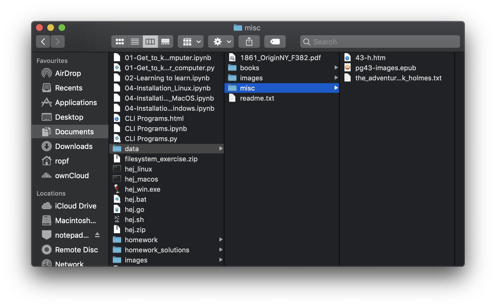

---
jupyter:
  jupytext:
    text_representation:
      extension: .md
      format_name: markdown
      format_version: '1.1'
      jupytext_version: 1.1.7
  kernelspec:
    display_name: Python 3
    language: python
    name: python3
---

<!-- #region {"slideshow": {"slide_type": "slide"}} -->
# No Programming Today!


<!-- #endregion -->

<!-- #region {"slideshow": {"slide_type": "fragment"}} -->
Today's session is not about programming Python! We will switch to this topic on Wednesday.

Instead, this session is about how to interact with your computer so that you can effectively program it with Python. Today, we are having a session on what is called _computer literacy_
<!-- #endregion -->

<!-- #region {"slideshow": {"slide_type": "fragment"}} -->
  > computer-literate | kəmˌpjuːtəˈlɪt(ə)rət |
  >
  > (of a person) having sufficient knowledge and skill to be able to use computers; familiar with the operation of computers
 >
 > [Oxford Dictionary of English](https://en.oxforddictionaries.com/definition/computer-literate)
<!-- #endregion -->

<!-- #region {"slideshow": {"slide_type": "slide"}} -->
# What is a computer?
<!-- #endregion -->

<!-- #region {"slideshow": {"slide_type": "fragment"}} -->

  > An electronic device for storing and processing data, typically in binary form, according to instructions given to it in a variable program.
  >
  > [Oxford Dictionary of English](https://en.oxforddictionaries.com/definition/computer)
<!-- #endregion -->

<!-- #region {"slideshow": {"slide_type": "fragment"}} -->

  > A computer is a universal machine in that it is capable of doing whatever man is capable of instructing it to do.
  >
  > [Internet Archive](https://archive.org/details/ComputerAndTheMindOfManP3TheUniversalMachine)
<!-- #endregion -->

<!-- #region {"slideshow": {"slide_type": "fragment"}} -->

  > A computer is a device that can perform actions on input (which is also called data). The actions are specified by a program, which is a sequence of instructions.
  >
  > [Interactive Python](http://interactivepython.org/runestone/static/StudentCSP/CSPTuring/whatIsComputer.html)
<!-- #endregion -->

<!-- #region {"slideshow": {"slide_type": "slide"}} -->
# What is a computer working on?


  > [...] human action typically involves the making and manipulation of artifacts [...]
  >
  > https://plato.stanford.edu/entries/artifact/

Usually, these _artifacts_ are the data that we store and process
<!-- #endregion -->

<!-- #region {"slideshow": {"slide_type": "fragment"}} -->

Nice! On computers what are:

  * the _actions_ and
  * what are the _artifacts_?
<!-- #endregion -->


<!-- #region {"slideshow": {"slide_type": "fragment"}} -->

Through the eyes of your operating system:
  * the _actions_ are _programs_ and
  * and the _artifacts_ are _files_, _directories_, _paths_
<!-- #endregion -->

<!-- #region {"slideshow": {"slide_type": "subslide"}} -->
Today, we will focus on

 * how to execute _programs_
 * understand and handle _files_
 * understand and navigate _directories_ and _paths_
<!-- #endregion -->


<!-- #region {"slideshow": {"slide_type": "subslide"}} -->
# The Command Line?

You can start the command line as in the following:

  * On Windows: click the spotlight icon to the bottom left, type `cmd.exe`, and hit return
  * On MacOS: press `cmd⌘+space` type in `terminal` and press return
  * On Linux: press `ctrl+alt+t` or click on the `terminal` icon in your graphical user interface (GUI)

The command-line (or terminal) is a textual user interface to your computer's operating system. That is, you can issues commands that the computer executes accordingly.
<!-- #endregion -->

<!-- #region {"slideshow": {"slide_type": "subslide"}} -->
## Running Programs from the Command-line

Try out these commands in your command line. After you wrote them, press the `Return` key to execute them:

### MacOS/Linux
  
  * `date`
  * `clear`
  * `echo "Hello World"`
  * MacOS: `hej_macos`
  * Linux: `hej_linux`
  
  
### Windows

  * `date /t`
  * `cls`
  * `echo "Hello World"`
  * `hej_win.exe`
<!-- #endregion -->

<!-- #region {"slideshow": {"slide_type": "subslide"}} -->
Usually, you would run/start/execute a program by clicking its icon in the graphical user interface (GUI).

Try to do that with the respective `hej_win.exe`, `hej_macos`, or `hej_linux` program.

What happens?
<!-- #endregion -->

<!-- #region {"slideshow": {"slide_type": "fragment"}} -->
In the command-line you run/start/execute programs by issuing the corresponding program name. As you did earlier.
<!-- #endregion -->

<!-- #region {"slideshow": {"slide_type": "fragment"}} -->
This is how we are going to use our computers for the rest of this seminar.
<!-- #endregion -->

<!-- #region {"slideshow": {"slide_type": "subslide"}} -->
# What are Programs?
<!-- #endregion -->

<!-- #region {"slideshow": {"slide_type": "fragment"}} -->
  > A computer program is a collection of instructions that performs a specific task when executed by a computer.
  >
  > https://en.wikipedia.org/wiki/Computer_program


  > computer program - [...] a sequence of instructions that a computer can interpret and execute
  >
  > https://www.thefreedictionary.com/computer+program


This is what we are going to write in Python from Wednesday on. Today, we just focus on running other people's programs.
<!-- #endregion -->

<!-- #region {"slideshow": {"slide_type": "fragment"}} -->
For example, the commands `date`, `echo`, as well as the earlier used `hej_win.exe`, `hej_macos`, and `hej_linux` are all small programs.
<!-- #endregion -->

<!-- #region {"slideshow": {"slide_type": "subslide"}} -->
## Passing Arguments to a Program on the Command-line

When you call programs from the CLI, most often you can pass arguments to it. Try that for example with the respective `hej_*` program from the earlier exercise:

#### Windows

```bash
hej_win.exe Ghost
```

#### MacOS

```bash
./hej_macos Monster
```

#### Linux

```bash
./hej_linux Kermit
```
<!-- #endregion -->

<!-- #region {"slideshow": {"slide_type": "fragment"}} -->
Arguments are meant to parametrize a program. For example, to make it work on a particular datum (as in the the name given above), a particular file, directory, etc.
<!-- #endregion -->

<!-- #region {"slideshow": {"slide_type": "subslide"}} -->
## CLI Usability

### Code completion with TAB (⇥)

You can start typing and complete your command by hitting the tabulator key (⇥). In case there are many commands matching the start string, they will be displayed.

### Browse through history with Curser Up/Down (↑/↓)

You can save even more typing by going back in time and choose and edit commands that you entered earlier.
<!-- #endregion -->

<!-- #region {"slideshow": {"slide_type": "slide"}} -->
# What are Files?

<!-- #endregion -->

<!-- #region {"slideshow": {"slide_type": "fragment"}} -->

Files are information containers.

> A computer file is a computer resource for recording data [...] in a computer storage device.
>
> https://en.wikipedia.org/wiki/Computer_file
<!-- #endregion -->

<!-- #region {"slideshow": {"slide_type": "fragment"}} -->
Interestingly, programs are also files. They are _executable_ files.
<!-- #endregion -->

<!-- #region {"slideshow": {"slide_type": "fragment"}} -->
Your MP3 files or photos are not programs as they cannot be executed, instead, they are data for special programs -your music player or photo viewer- that know how to present them.
<!-- #endregion -->

<!-- #region {"slideshow": {"slide_type": "slide"}} -->
# What are Directories?

  > Most computers organize files into hierarchies using directories
  >
  > https://en.wikipedia.org/wiki/Computer_file

**OBS**: we -and many people- use the terms _directory_ and _folder_ synonymiously.

  > Each folder can contain an arbitrary number of files, and it can also contain other folders. These other folders are referred to as subfolders. Subfolders can contain still more files and folders and so on, thus building a tree-like structure
  >
  > https://en.wikipedia.org/wiki/Computer_file
<!-- #endregion -->

<!-- #region {"slideshow": {"slide_type": "subslide"}} -->
## Directories and Files in Windows

In Windows you can view files and directories through the _File Explorer_ program.


<!-- #endregion -->

<!-- #region {"slideshow": {"slide_type": "subslide"}} -->
## Directories and Files in MacOS

In MacOS you use _Finder_ to browse your files and folders.


<!-- #endregion -->

<!-- #region {"slideshow": {"slide_type": "subslide"}} -->
## Directories and Files Conceptually

Your computer organizes data in files and directories.

Directories can contain other directories and other files.

For example, the following is a directory tree, where the `data` directory contains the two files `1861_OriginNY_F382.pdf` and `readme.txt` and three more sub-directories, `books`, `images`, `misc`.

<!-- #endregion -->

<!-- #region {"slideshow": {"slide_type": "fragment"}} -->
This is the same tree structure shown in the command line:
```
data/
├── 1861_OriginNY_F382.pdf
├── books
│   ├── a_study_in_scarlet.txt
│   ├── his_last_bow.txt
│   └── moby_dick.txt
├── images
│   ├── adult-attractive-beautiful-871495.png
│   ├── architecture-building-clouds-374624-2.png
│   ├── beautiful-brunette-cute-774909.png
│   ├── beaver
│   │   ├── image_0001.jpg
│   │   ├── image_0002.jpg
│   │   ├── image_0003.jpg
│   │   ├── image_0004.jpg
│   │   └──image_0005.jpg
│   ├── dew-drop-droplet-544980.png
│   └── snoopy
│       ├── image_0001.jpg
│       ├── image_0002.jpg
│       └── image_0003.jpg
├── misc
│   ├── 43-h.htm
│   ├── pg43-images.epub
│   └── the_adventures_of_sherlock_holmes.txt
└── readme.txt
```
<!-- #endregion -->

<!-- #region {"slideshow": {"slide_type": "subslide"}} -->
### Basic Operations on Files and Directories

In general, there are the following operations on files and directories:

  * **Create**
  * **Move**/**Rename**
  * **Delete**

For files you can additionally:

  * **Read** from,
  * **Write** to,
  * **Append** to files.

For directories you can additionally **list** their contents.

All these operations are performed by programs.
<!-- #endregion -->

<!-- #region {"slideshow": {"slide_type": "slide"}} -->
## Working with Directories
<!-- #endregion -->

<!-- #region {"slideshow": {"slide_type": "fragment"}} -->
### In which directory am I currently?

The command `pwd`, prints the working directory, i.e., the one in which you _are_ currently.

**Let's work together!**

#### Windows

```
C:\> cd
```


#### MacOS/Linux

```bash
$ pwd
```
<!-- #endregion -->

<!-- #region {"slideshow": {"slide_type": "subslide"}} -->
Usually, when starting the CLI/terminal, the current directory is your _home_ directory.

On **Windows** it is something similar to:

```
C:\Users\<your_user_name>
```

On **MacOS** it is:

```bash
/Users/<your_user_name>
```

and on **Linux** it should be something like:

```bash
/home/<your_user_name>
```
<!-- #endregion -->

<!-- #region {"slideshow": {"slide_type": "subslide"}} -->
### Listing the Contents of a Directory

The `ls`/`dir` command lists the contents of a directory. In its plain form it lists the contents of the current directory


#### Windows

```
C:\> dir
```


#### MacOS/Linux

```bash
$ ls
```
<!-- #endregion -->

<!-- #region {"slideshow": {"slide_type": "subslide"}} -->
If you append a path to the `ls`/`dir` command it lists the contents of the specified directory

#### Windows

```
C:\> dir AppData\Local\Temp
```


#### MacOS/Linux

```bash
$ ls /tmp
```

Here `AppData\Local\Temp` and `/tmp` respectively is the first argument to the `dir`/`ls` program.
<!-- #endregion -->

<!-- #region {"slideshow": {"slide_type": "subslide"}} -->
### Creating a Directory

Let's create some example directories and files in our home directory.

#### Windows/MacOS/Linux

```bash
$ mkdir summer19
```

Creates the directory `summer19`. You can double check that by running `dir`/`ls`, which should list it now.

Here again, `summer19` is the first argument to the `mkdir` program.
<!-- #endregion -->

<!-- #region {"slideshow": {"slide_type": "fragment"}} -->
Now, create two more directories:

#### Windows

```
$ mkdir summer19\lecture_notes
$ mkdir summer19\my_programs
```

#### MacOS/Linux

```bash
$ mkdir summer19/lecture_notes
$ mkdir summer19/my_programs
```

And check with `dir`/`ls` that they were really created.
<!-- #endregion -->

<!-- #region {"slideshow": {"slide_type": "subslide"}} -->
### Changing the Current Directory

You can change to another directory with the `cd` command.

#### Windows

```
$ cd summer19\my_programs
```

#### MacOS/Linux

```bash
$ cd summer19/my_programs
```

Now, you are in the directory `my_programs` in the directory `summer19`.
How can you check that again?
<!-- #endregion -->

<!-- #region {"slideshow": {"slide_type": "fragment"}} -->
You can go one directory _up_ with the `../` notation.

That is, run

```bash
$ cd ../lecture_notes
```

In which directory are you now? Check with `cd` (Windows)/`pwd` (MacOS/Linux).
<!-- #endregion -->

<!-- #region {"slideshow": {"slide_type": "slide"}} -->
# What are Paths?
<!-- #endregion -->

<!-- #region {"slideshow": {"slide_type": "fragment"}} -->
Paths describe locations in directory trees.
<!-- #endregion -->

<!-- #region {"slideshow": {"slide_type": "fragment"}} -->
```
summer19/
├── lecture_notes
└── my_programs
```
<!-- #endregion -->

<!-- #region {"slideshow": {"slide_type": "subslide"}} -->
## Forms of Paths: a) Absolute Paths

##### Windows

Absolute paths start with a device name, such as `C:\`, `D:\`, ...

For example, `C:\Users\rhp\AppData\Local\Temp`, `C:\Users\rhp` are absolute paths.

##### MacOS/Linux

Absolute paths start with a leading slash `/`.

For example, `/tmp`, `/home/ropf/`, `/Users/rhp` are absolute paths.
<!-- #endregion -->

<!-- #region {"slideshow": {"slide_type": "subslide"}} -->
#### Paths navigate along directory trees

In the Windows world it looks like this:

That is, you have multiple roots. One for each device connected to your computer, i.e., your hard disk is usually drive `C:\`, back in the days floppy disk drives were `A:\` and `B:\`


<!-- #endregion -->

<!-- #region {"slideshow": {"slide_type": "subslide"}} -->
#### Paths navigate along directory trees

In the Linux/Unix world it looks like this:

That is, you have a single root `/` and everything else is organized below that.

<!-- #endregion -->

<!-- #region {"slideshow": {"slide_type": "subslide"}} -->
## Forms of Paths: b) Relative Paths

Relative paths start with a directory name or a dot `.`.


##### Windows

For example, `summer19\` or `summer19\lecture_notes\session1.txt` are relative paths.

Note, the `.` is a shorthand for the current directory.

That is, `summer19\lecture_notes\session1.txt` and `.\summer19\lecture_notes\session1.txt` are equivalent.


##### MacOS/Linux

For example, `summer19/` or `summer19/lecture_notes/session1.txt` are relative paths.

Note, the `.` is a shorthand for the current directory.

That is, `summer19/lecture_notes/session1.txt` and `./summer19/lecture_notes/session1.txt` are equivalent.

<!-- #endregion -->

<!-- #region {"slideshow": {"slide_type": "subslide"}} -->
## Path Separators 

As you can see Windows and MacOS/Linux paths use a different character for separation. On Windows it is the backslash `\` and on MacOS/Linux it is the slash `/`. We will come back to that in later sessions.


#### Windows Paths

  * `C:\Users\rhp\AppData\Local\Temp`
  * `C:\Users\rhp`
  * `summer19\`
  * `summer19\lecture_notes\session1.txt`

##### MacOS/Linux Paths

  * `/tmp`
  * `/home/ropf/`
  * `/Users/rhp`
  * `summer19/`
  * `summer19/lecture_notes/session1.txt`
<!-- #endregion -->

<!-- #region {"slideshow": {"slide_type": "subslide"}} -->
## Modifying the Behavior of Programs 


You cannot only parametrize programs with data. You can also modify the behavior of programs on the CLI by passing flags/switches.

For example, you need a bit more of information on the directories and files you list:


#### MacOS/Linux

```bash
$ ls
1861_OriginNY_F382.pdf	books			images			misc			readme.txt
```
<!-- #endregion -->

<!-- #region {"slideshow": {"slide_type": "fragment"}} -->
```bash
$ ls -lh
total 26672
-rw-r--r--  1 me  staff    13M May 22  2015 1861_OriginNY_F382.pdf
drwxr-xr-x  5 me  staff   160B Jun 13 15:17 books
drwxr-xr-x  9 me  staff   288B Jun 13 15:16 images
drwxr-xr-x  5 me  staff   160B Jun 13 15:23 misc
-rw-r--r--  1 me  staff   513B Jun 13 15:25 readme.txt
```
<!-- #endregion -->

<!-- #region {"slideshow": {"slide_type": "fragment"}} -->
#### Windows

Switches in Windows have another syntax. For example, to list contents of a directory sorted by size:

```
C:\ dir /os
```
<!-- #endregion -->

<!-- #region {"slideshow": {"slide_type": "subslide"}} -->
## Flags?? Arguments??

Most CLI programs can consume many switches and arguments. If you do not know how to use a program ask for `help` on Windows or read the `man`ual on MacOS/Linux.

#### Windows

```
C:\>help dir
Displays a list of files and subdirectories in a directory.

DIR [drive:][path][filename] [/A[[:]attributes]] [/B] [/C] [/D] [/L] [/N]
  [/O[[:]sortorder]] [/P] [/Q] [/R] [/S] [/T[[:]timefield]] [/W] [/X] [/4]

  [drive:][path][filename]
              Specifies drive, directory, and/or files to list.
```


#### MacOS/Linux

```bash
$ man ls
LS(1)                     BSD General Commands Manual                    LS(1)

NAME
     ls -- list directory contents

SYNOPSIS
     ls [-ABCFGHLOPRSTUW@abcdefghiklmnopqrstuwx1] [file ...]
```
<!-- #endregion -->

<!-- #region {"slideshow": {"slide_type": "slide"}} -->
## More Commands


We will:

  * copy,
  * move, 
  * rename, and 
  * delete

files and directories.
<!-- #endregion -->

<!-- #region {"slideshow": {"slide_type": "fragment"}} -->
To work on the same directories and files 

  * Download and uncompress the ZIP file `filesystem_exercise.zip` from https://github.com/itu-qsp/2019-summer/raw/master/session-1/filesystem_exercise.zip (shortlink: https://tinyurl.com/yygbqln7)
  * Navigate to the directory to where you uncompressed the file
  
    ```
    cd <path_to_uncompressed>/data
    ```
    
<!-- #endregion -->

<!-- #region {"slideshow": {"slide_type": "subslide"}} -->
### Copying Files

The `copy`/`cp` command can copy files and directories. It usually requires two arguments, saying _which_ file (first argument) to copy to _where_ (second argument).

If you specify a directory as the second argument, then the file, which is specified by the first argument, is copied to the target directory with the original name.

In case you provide a file name as the second argument, then the file is copied and renamed directly.

#### Windows

```books
C:\> copy misc\the_adventures_of_sherlock_holmes.txt books\
C:\> copy misc\the_adventures_of_sherlock_holmes.txt books\sherlock.txt
```

#### MacOS/Linux

```bash
$ cp misc/the_adventures_of_sherlock_holmes.txt books/
$ cp misc/the_adventures_of_sherlock_holmes.txt books/sherlock.txt
```
<!-- #endregion -->

<!-- #region {"slideshow": {"slide_type": "subslide"}} -->
### Copying Directories

Directories are a little different because you can risk not just copying one thing. So we have to modify the behavior of copy to just take and copy everything.

#### Windows

```
C:\> xcopy images\snoopy images\snoopy_images\
```

#### MacOS/Linux

We can do that with the flag `-r`:

```bash
$ cp -r images/snoopy images/snoopy_images
```
<!-- #endregion -->

<!-- #region {"slideshow": {"slide_type": "subslide"}} -->
### Moving/Renaming Files

The `mv` command is similar to the `cp` command. However, the specified file is moved, i.e., no copy is created.

```bash
$ mv 1861_OriginNY_F382.pdf books/
```

To rename a file you use the mv command too. Just move your file to a file with a new name.

```bash
$ mv books/1861_OriginNY_F382.pdf books/the_origin_of_species.pdf
```
<!-- #endregion -->

<!-- #region {"slideshow": {"slide_type": "subslide"}} -->
### Moving/Renaming a Directory

You might want to rename a directory, e.g., after creating them with a wrong spelling

```bash
$ mkdir wrtings
$ mv wrtings writing
```

Check that you now have a directory `writing` in your working directory.
<!-- #endregion -->

<!-- #region {"slideshow": {"slide_type": "subslide"}} -->
### Deleting a Directory

**OBS**: Do this carefully! What is deleted is deleted and usually cannot be restored!

#### Windows

```
C:\> rmdir writing
```


#### MacOS/Linux

```bash
$ rm -r writing
```

What is the argument here and what is a switch? What are the two saying?
<!-- #endregion -->

<!-- #region {"slideshow": {"slide_type": "subslide"}} -->
### Deleting Files

Similarly to deleting directories, you can delete files with the help of the `rm` command.

```bash
$ rm images/snoopy/image_0035.jpg
```
<!-- #endregion -->

<!-- #region {"slideshow": {"slide_type": "subslide"}} -->
### Wildcards

List all the files in `images/snoopy` that start with `image_003`
<!-- #endregion -->

<!-- #region {"slideshow": {"slide_type": "fragment"}} -->
Wildcards to the rescue. Wildcards are special _joker_ characters. For example an asterisk `*` just means that there are zero or more arbitrary characters from this position on.

#### Windows

```
C:\> cd Downloads\filesystem_exercise\data\images\snoopy
C:\Users\vagrant\Downloads\filesystem_exercise\data\images\snoopy> dir image_003*.jpg 
``` 

#### MacOS/Linux

```bash
$ cd ~/Downloads/data/snoopy
$ ls image_003*
```
<!-- #endregion -->

<!-- #region {"slideshow": {"slide_type": "slide"}} -->
# Reflection

How fast and conveniently could you select and copy files matching `images/snoopy/image_001*` in your GUI?

That is the reason, why all graphical user interfaces since their inception until today come with a CLI.
<!-- #endregion -->

<!-- #region {"slideshow": {"slide_type": "subslide"}} -->
## Text is an efficient tool for communication


* Text is a **stable communication technology**
* Text is an **efficient communication technology**

* Pictures are good, but try to translate this into a picture: "Human rights are moral principles"
* You are pretty much going to be working with only communication technology, so knowing text is smart


<!-- #endregion -->

<!-- #region {"slideshow": {"slide_type": "slide"}} -->
## All computers can be controlled via a terminal

All computers came from a text-based interface. Even Apple. And **all** computers still allow text-based commands.


This is from Apple's A/UX interface from 1988.
<!-- #endregion -->

<!-- #region {"slideshow": {"slide_type": "subslide"}} -->

Amiga OS 1.3 from 1988
<!-- #endregion -->

<!-- #region {"slideshow": {"slide_type": "skip"}} -->
--------------------------
<!-- #endregion -->

<!-- #region {"slideshow": {"slide_type": "subslide"}} -->
## Command-line Primers

Find more examples in the following resources:

#### Windows
  
  * https://www.bleepingcomputer.com/tutorials/windows-command-prompt-introduction/
  * http://abacus.gene.ucl.ac.uk/software/CommandLine.Windows.pdf


#### MacOS/Linux

  * https://www.codecademy.com/learn/learn-the-command-line
  * http://lifehacker.com/5633909/who-needs-a-mouse-learn-to-use-the-command-line-for-almost-anything
  * http://www.makeuseof.com/tag/a-quick-guide-to-get-started-with-the-linux-command-line/
  * http://mvhs-fuhsd.org/java/Units/Unit01/LinuxCommandLinePrimer.pdf

<!-- #endregion -->
