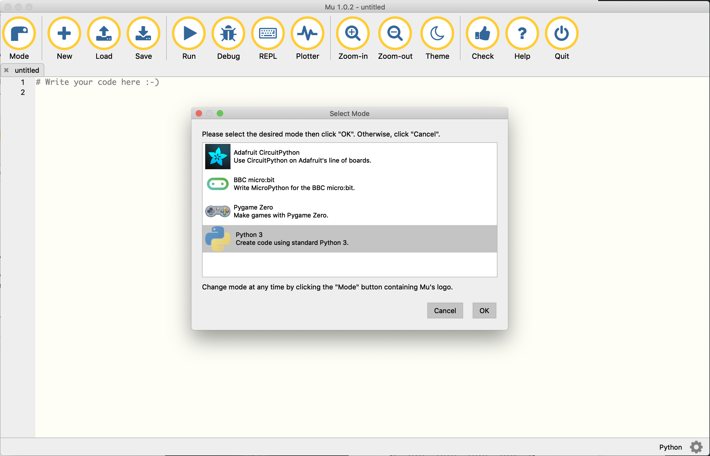

---
jupyter:
  jupytext:
    text_representation:
      extension: .md
      format_name: markdown
      format_version: '1.1'
      jupytext_version: 1.1.7
  kernelspec:
    display_name: Python 3
    language: python
    name: python3
---

<!-- #region -->
# Installation Guide MacOS


This guide explains how to install all the tools needed for the seminar.

You will install:
  
  * The Python interpreter (the "programming language") via a distribution called _Anaconda_
  * A code editor

To make this easy for you we will install a number of tools and some of them depend on the previous tools installed so follow the order listed and grab a TA or lecturer if the test seems to throw up something weird. 
<!-- #endregion -->

<!-- #region -->
## 1 - Installing Anaconda from USB key or Website.

If you are in class and have access to one of the distributed USB keys, then copy the folder named `MacOS` to your computer. Subsequently, pass the USB key on to one of your fellow students or an instructor **before** proceeding.  

If you are performing the installation at home instead of at ITU navigate to https://www.anaconda.com/distribution/#macos and download Anaconda with Python 3.7 by clicking the big green `Download` button. (The direct download link is: https://repo.anaconda.com/archive/Anaconda3-2019.03-MacOSX-x86_64.pkg).

Run the installer `Anaconda3-2019.03-MacOSX-x86_64.pkg` either from the `MacOS` folder in case you had access to a USB key or from the `Downloads` folder in case you are working from home.

For detailed installation instructions, navigate to https://docs.anaconda.com/anaconda/install/mac-os#macos-graphical-install and follow the instructions from **step 3**.  

Do **not** install PyCharm, we will not need it in this seminar and you can install it later in case you require it for your studies/work


### Test Your Python Installation.

Open a terminal: 

  * either open Spotlight by pressing `command + space`, type `terminal`, and press `Enter`
  * or click the icon if it is present on your Dock 


Run the following command:

```bash 
$ python --version
```

which should print `Python 3.7.3`.
<!-- #endregion -->

<!-- #region -->
## 2 - Installing the Mu-Editor


In the terminal run the following command:

```bash
$ pip install mu-editor
```

After the installation completes try if you can run the editor. Enter the following in the terminal:

```bash
$ mu-editor
```

That should open a window as illustrated below.



For now, just close the editor. We will use it in the next session.
<!-- #endregion -->

## Congratulations, you are done installing everything we need for now!
