# Hej!

[Download this!](https://github.com/itu-qsp/2019-summer/raw/master/session-1/hej.zip)


## Guides for Three Operating Systems

The purpose of this guide is that you get to know your computer from a side that you likely did not know so far. You will control your computer via the
 _terminal_.

This will be the main mode of operation for this seminar. Do not fear, it will feel a bit strange as first, just like talking a foreign language to your best friend but it will be fun and it will be an experience :)


Follow the respective guide for your operating system below:

  * [Windows](#win)
  * [MacOS](#macos)
  * [Ubuntu](#linux)

------

## Once your neighbor is done, discuss with her/him what you just did.

  - What have you done?
  - What is the meaning of `cd`?
  - What is `hej_linux`?
  - What does your computer do when you type `hej_linux` into the terminal and press `Enter`? Can you compare that to some action that you usually perform on your computer?
  - What is the stuff on each line that precedes your typing?


-------


<a name="win"></a>
## Windows

### Downloading and Extracting a Program

  * Click the [Download this!](https://github.com/itu-qsp/2019-summer/raw/master/session-1/hej.zip) link
  * After clicking on the `Open` button, this will download the linked ZIP file into your `Downloads` folder, as illustrated below

    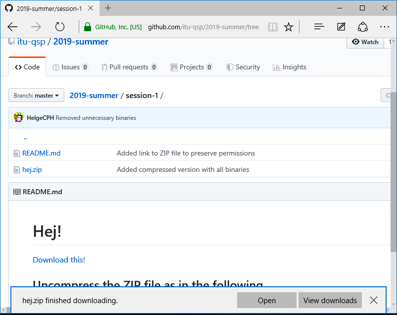
    - _OBS_: we use the terms _directory_ and _folder_ synonymously
  * Now, extract/uncompress the contents of the downloaded ZIP file by
    - first clicking `Extract` in the top
      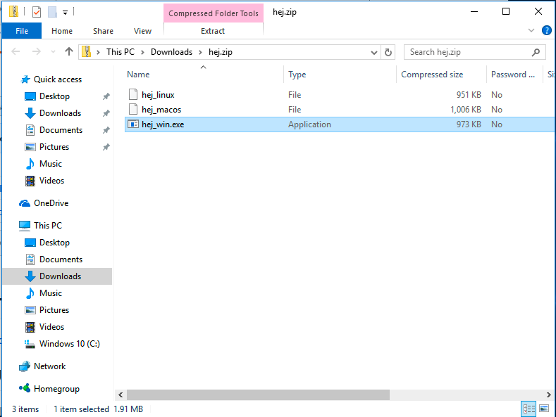
    - followed by clicking the `Extract all` icon
      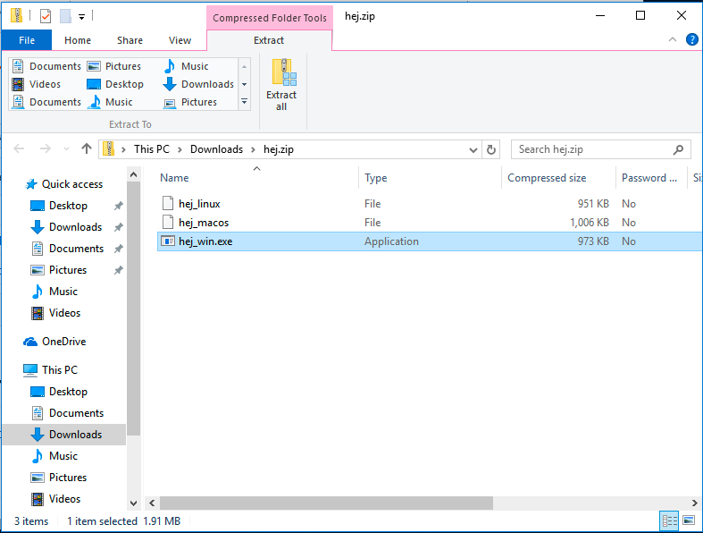


### The Terminal - [New Way, New Life](https://www.youtube.com/watch?v=OkIFE5zlUPY)

#### Open the Terminal

  * click the magnifying glass in the bottom left and start typing `cmd.exe`
  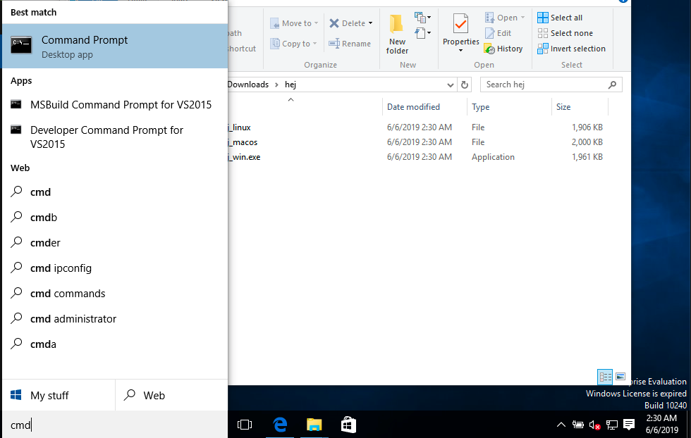
  * after clicking on the appearing commando prompt icon a terminal window similar to the one below will be displayed
  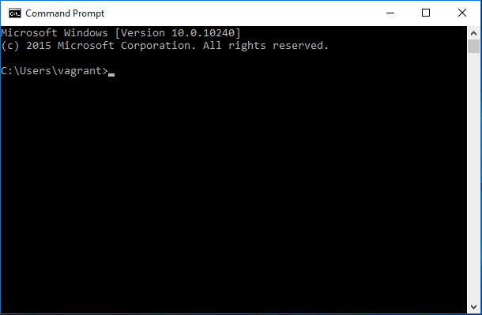

#### Work in the Terminal

In the terminal window do the following two things:

  1. change the current working directory to the one where you extracted the ZIP file
  2. execute the program `hej_win.exe`

You do _1._ by typing:
```
cd %HOMEPATH%/Downloads/hej
```
followed by a press on the `Enter` key.

  - The _Enter_/_Return_ key is the on the right-hand side of your keyboard, with a symbol similar to this: ⏎
  - _OBS_: we use the terms _Enter_ key and _Return_ key synonymously

You do 2. by typing:
```bash
hej_win.exe
```
followed by a press on the `Enter` key.

Interact with the program as is asks you to do.
What do you see now?


-------


<a name="macos"></a>
## MacOS

### Downloading and Extracting a Program

  * Click the [Download this!](https://github.com/itu-qsp/2019-summer/raw/master/session-1/hej.zip) link
  * This will automatically download and uncompress the linked ZIP file into your `Downloads` folder, as illustrated below
  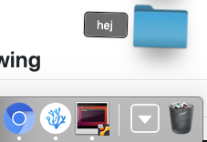
    - _OBS_: we use the terms _directory_ and _folder_ synonymously

### The Terminal - [New Way, New Life](https://www.youtube.com/watch?v=OkIFE5zlUPY)

#### Open the Terminal

  * open the Spotlight Search by pressing `command + space`
  * type `terminal`, and press `Enter` in the appearing search box
    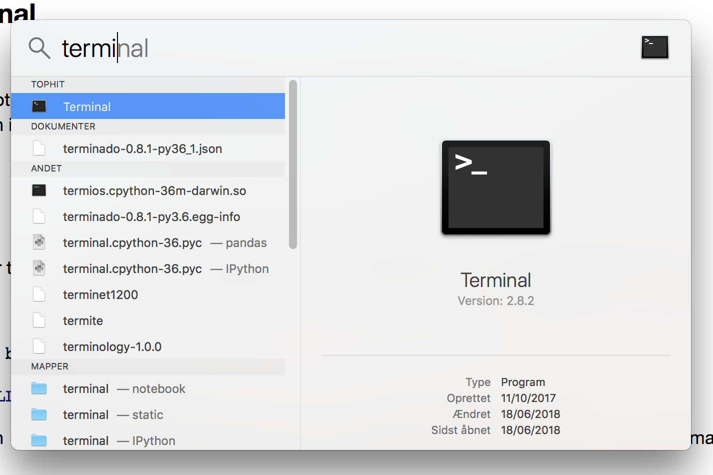

#### Work in the Terminal

In the terminal window (which looks similar to the illustration below) do the following two things:


  1. change the current working directory to the one where you extracted the ZIP file
  2. execute the program `hej_macos`

You do _1._ by typing:
```bash
cd $HOME/Downloads/hej
```
followed by a press on the `Enter` key.

  - The _Enter_/_Return_ key is the on the right-hand side of your keyboard, with a symbol similar to this: ⏎
  - _OBS_: we use the terms _Enter_ key and _Return_ key synonymously

You do 2. by typing:
```bash
./hej_macos
```
followed by a press on the `Enter` key.

Interact with the program as is asks you to do.
What do you see now?


-------


## Ubuntu <a name="linux"></a>

### Downloading and Extracting a Program

  * Click the [Download this!](https://github.com/itu-qsp/2019-summer/raw/master/session-1/hej.zip) link
  * For the download, choose `Open with: Archive Manager`
  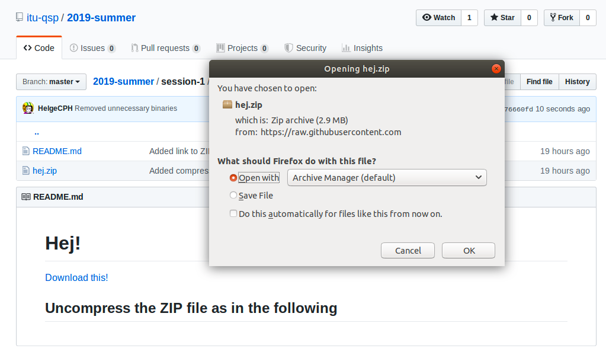
  * uncompress/extract the ZIP file to a directory of your choice
    - Here, I assume that you extract the files to your user's `Downloads` directory
      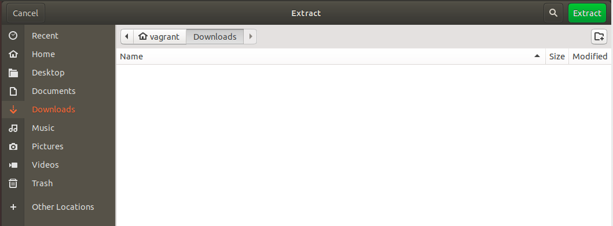
    - _OBS_: we use the terms _directory_ and _folder_ synonymously

### The Terminal - [New Way, New Life](https://www.youtube.com/watch?v=OkIFE5zlUPY)

#### Open the Terminal

  - Click on the logo in the bottom left

    
  - Type the word `terminal` in the appearing search box and mouse-click on the `terminal` icon

    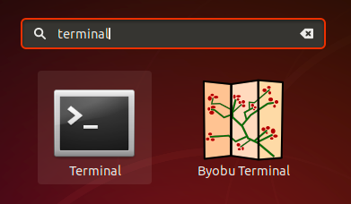

#### Work in the Terminal

In the terminal window (which looks similar to the illustration below) do the following two things:
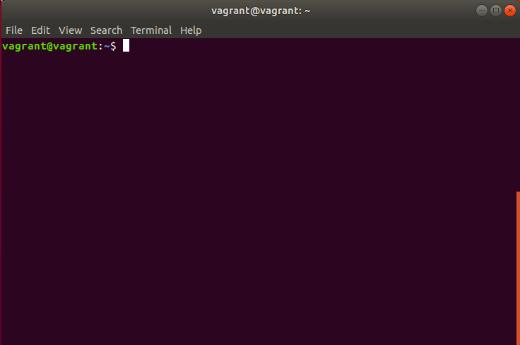

  1. change the current working directory to the one where you extracted the ZIP file
  2. execute the program `hej_linux`

You do _1._ by typing:
```bash
cd $HOME/Downloads
```
followed by a press on the `Enter` key.

  - The _Enter_/_Return_ key is the on the right-hand side of your keyboard, with a symbol similar to this: ⏎
  - _OBS_: we use the terms _Enter_ key and _Return_ key synonymously

You do 2. by typing:
```bash
./hej_linux
```
followed by a press on the `Enter` key.

Interact with the program as is asks you to do.
What do you see now?

